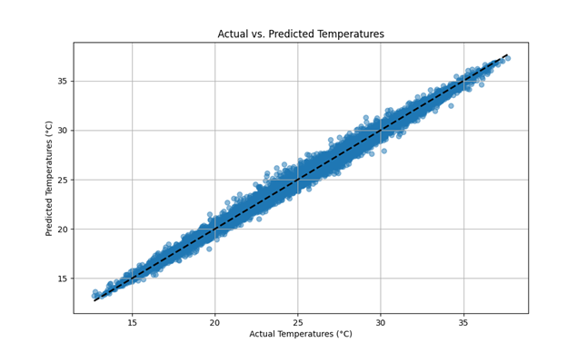

---

<!-- PROJECT SHIELDS -->
[![Contributors][contributors-shield]][contributors-url]
[![Forks][forks-shield]][forks-url]
[![Stargazers][stars-shield]][stars-url]
[![Issues][issues-shield]][issues-url]
[![MIT License][license-shield]][license-url]
[![LinkedIn][linkedin-shield]][linkedin-url]

<br />
<div align="center">

<h3 align="center">Weather Station with Machine Learning Capabilities</h3>

  <p align="center">
    A comprehensive weather monitoring and prediction system using IoT, web development, and machine learning.
    <br />
    <a href="https://github.com/sujalvaidya/ML-WeatherStation/issues/new?labels=bug&template=bug-report---.md">Report Bug</a>
    ·
    <a href="https://github.com/sujalvaidya/ML-WeatherStation/issues/new?labels=enhancement&template=feature-request---.md">Request Feature</a>
  </p>
</div>

<details>
  <summary>Table of Contents</summary>
  <ol>
    <li>
      <a href="#about-the-project">About The Project</a>
      <ul>
        <li><a href="#built-with">Built With</a></li>
      </ul>
    </li>
    <li>
      <a href="#getting-started">Getting Started</a>
      <ul>
        <li><a href="#prerequisites">Prerequisites</a></li>
        <li><a href="#installation">Installation</a></li>
      </ul>
    </li>
    <li><a href="#usage">Usage</a></li>
    <li><a href="#roadmap">Roadmap</a></li>
    <li><a href="#contributing">Contributing</a></li>
    <li><a href="#license">License</a></li>
    <li><a href="#contact">Contact</a></li>
    <li><a href="#acknowledgments">Acknowledgments</a></li>
  </ol>
</details>

## About The Project

This project is a Weather Station equipped with Machine Learning (ML) capabilities. It integrates real-time environmental data collection, data visualization on a web dashboard, and ML models to predict future weather conditions. The system utilizes an ESP8266 NodeMCU microcontroller, DHT11 and BMP280 sensors, and a rain sensor for data acquisition.

The machine learning component predicts temperature based on historical and real-time data, providing users with insightful forecasts via an interactive web dashboard.

### Key Features:

- Real-time weather data collection (temperature, humidity, pressure, rainfall).
- Data visualization through an interactive web dashboard.
- Machine learning-powered temperature predictions.


*Image of circuit*

<p align="right">(<a href="#readme-top">back to top</a>)</p>

### Built With

* **Hardware**: ESP8266 NodeMCU, DHT11 Sensor, BMP280 Sensor, Rain Sensor
* **Software**: Arduino IDE, Python (with scikit-learn), HTML, CSS, JavaScript (Chart.js), Bootstrap
* **Libraries**: ESP8266WiFi, ESP8266WebServer, Adafruit BMP280, DHTesp

<p align="right">(<a href="#readme-top">back to top</a>)</p>

## Getting Started

To get started with setting up the project locally, follow the simple steps below.

### Prerequisites

- **Arduino IDE**: To program the ESP8266 NodeMCU.
- **Python Libraries**: Install the following with `pip`:
  ```sh
  pip install scikit-learn requests pandas numpy openmeteo-requests
  ```

### Installation

1. Clone the repo
   ```sh
   git clone https://github.com/sujalvaidya/ML-WeatherStation.git
   ```
2. Flash the NodeMCU firmware using Arduino IDE.
3. Set up the Python environment to run the backend script.

<p align="right">(<a href="#readme-top">back to top</a>)</p>

## Usage

### Dashboard

The weather data is visualized using a responsive web dashboard:


*Image of the website dashboard displaying data*

- Access real-time data for temperature, humidity, pressure, and rainfall.
- View historical trends and predictions via interactive graphs.


*Image of actual hardware implementation*

### Machine Learning Implementation

The system uses a Random Forest Regressor to predict future temperature values. The machine learning model was trained using historical weather data from Bangalore, spanning seven years. The model, optimized through hyperparameter tuning, demonstrated outstanding predictive capabilities, achieving a Mean Squared Error (MSE) of 0.136, a Mean Absolute Error (MAE) of 0.269, an R² Score of 0.990, and an Explained Variance Score of 0.990. 


*Graph of actual vs. predicted temperatures*

### Prediction Errors


*Graph of prediction errors*

<p align="right">(<a href="#readme-top">back to top</a>)</p>

See the [open issues](https://github.com/sujalvaidya/ML-WeatherStation/issues) for a full list of proposed features and known issues.

<p align="right">(<a href="#readme-top">back to top</a>)</p>

## Contributing

Contributions are what make the open-source community an amazing place to learn, inspire, and create. Any contributions are **greatly appreciated**.

1. Fork the Project
2. Create your Feature Branch (`git checkout -b feature/AmazingFeature`)
3. Commit your Changes (`git commit -m 'Add some AmazingFeature'`)
4. Push to the Branch (`git push origin feature/AmazingFeature`)
5. Open a Pull Request

<p align="right">(<a href="#readme-top">back to top</a>)</p>

### Top contributors:

<a href="https://github.com/sujalvaidya/ML-WeatherStation/graphs/contributors">
  
</a>

## License

Distributed under the MIT License. See `LICENSE.txt` for more information.

<p align="right">(<a href="#readme-top">back to top</a>)</p>

## Contact

Sujal Vaidya - [@sujalyatin](https://twitter.com/sujalyatin) - sujalyatin@gmail.com

Project Link: [https://github.com/sujalvaidya/ML-WeatherStation](https://github.com/sujalvaidya/ML-WeatherStation)

<p align="right">(<a href="#readme-top">back to top</a>)</p>

## Acknowledgments

* [Openmeteo API](https://pypi.org/project/openmeteo-requests/)
* [Adafruit BMP280 Library](https://github.com/adafruit/Adafruit_BMP280_Library)
* [Chart.js](https://www.chartjs.org/docs/latest/)
* [Oikolab](https://docs.oikolab.com)
* [DHTesp](https://github.com/beegee-tokyo/DHTesp)
* [ESP8266 WebServer](https://github.com/esp8266/Arduino/tree/master/libraries/ESP8266WebServer)
* [scikit-learn](https://scikit-learn.org/stable/)

<p align="right">(<a href="#readme-top">back to top</a>)</p>

<!-- MARKDOWN LINKS & IMAGES -->
[contributors-shield]: https://img.shields.io/github/contributors/sujalvaidya/ML-WeatherStation.svg?style=for-the-badge
[contributors-url]: https://github.com/sujalvaidya/ML-WeatherStation/graphs/contributors
[forks-shield]: https://img.shields.io/github/forks/sujalvaidya/ML-WeatherStation.svg?style=for-the-badge
[forks-url]: https://github.com/sujalvaidya/ML-WeatherStation/network/members
[stars-shield]: https://img.shields.io/github/stars/sujalvaidya/ML-WeatherStation.svg?style=for-the-badge
[stars-url]: https://github.com/sujalvaidya/ML-WeatherStation/stargazers
[issues-shield]: https://img.shields.io/github/issues/sujalvaidya/ML-WeatherStation.svg?style=for-the-badge
[issues-url]: https://github.com/sujalvaidya/ML-WeatherStation/issues
[license-shield]: https://img.shields.io/github/license/sujalvaidya/ML-WeatherStation.svg?style=for-the-badge
[license-url]: https://github.com/sujalvaidya/ML-WeatherStation/blob/master/LICENSE.txt
[linkedin-shield]: https://img.shields.io/badge/-LinkedIn-black.svg?style=for-the-badge&logo=linkedin&colorB=555
[linkedin-url]: https://linkedin.com/in/sujalvaidya
